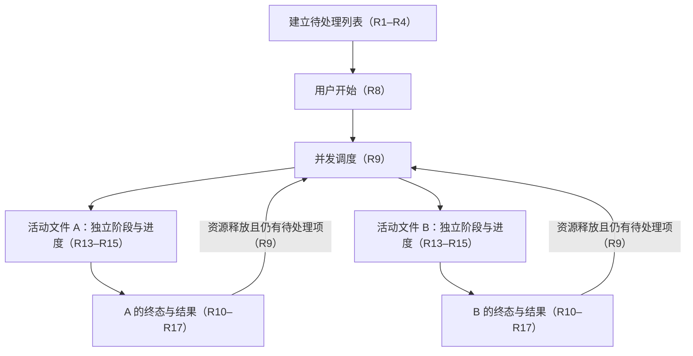
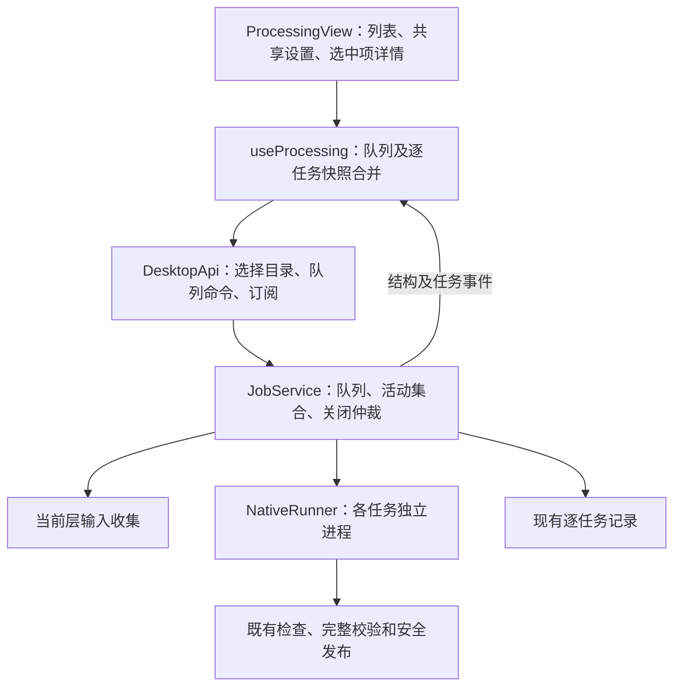
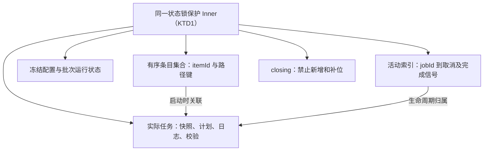
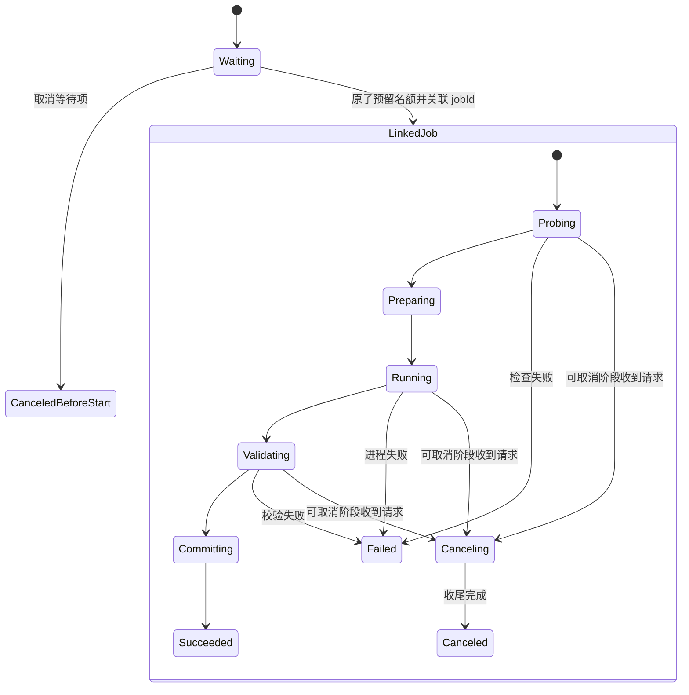
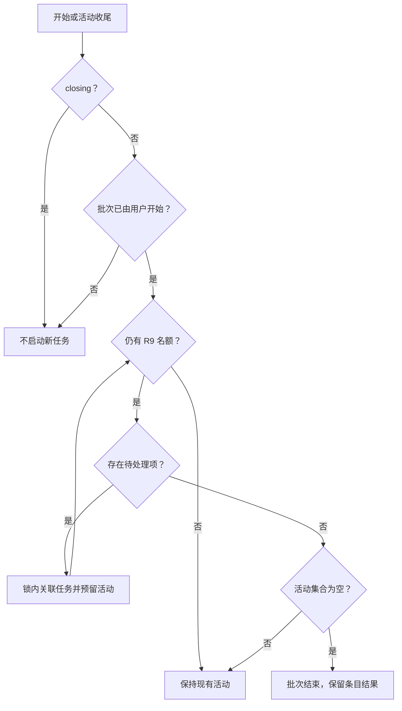
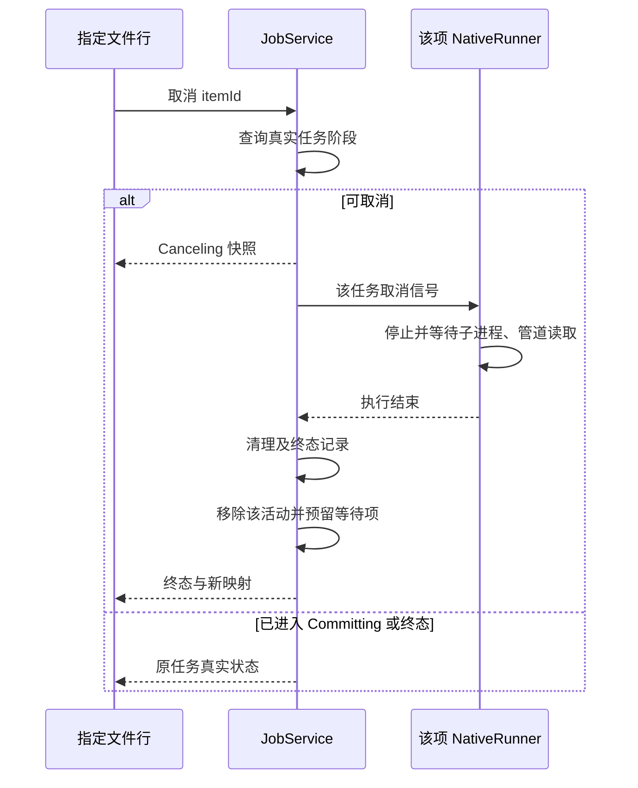
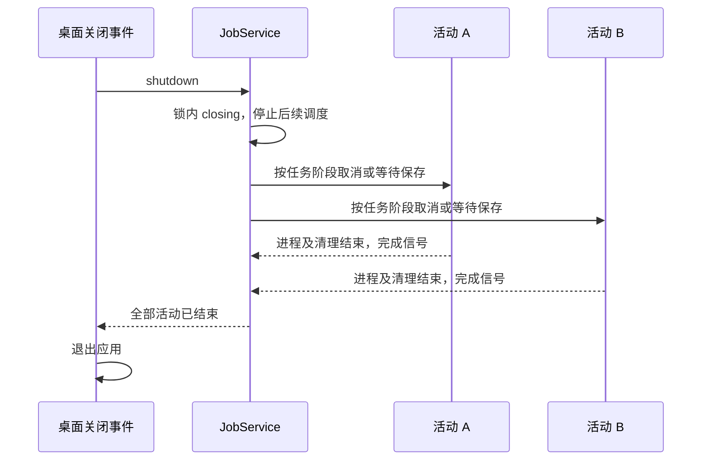
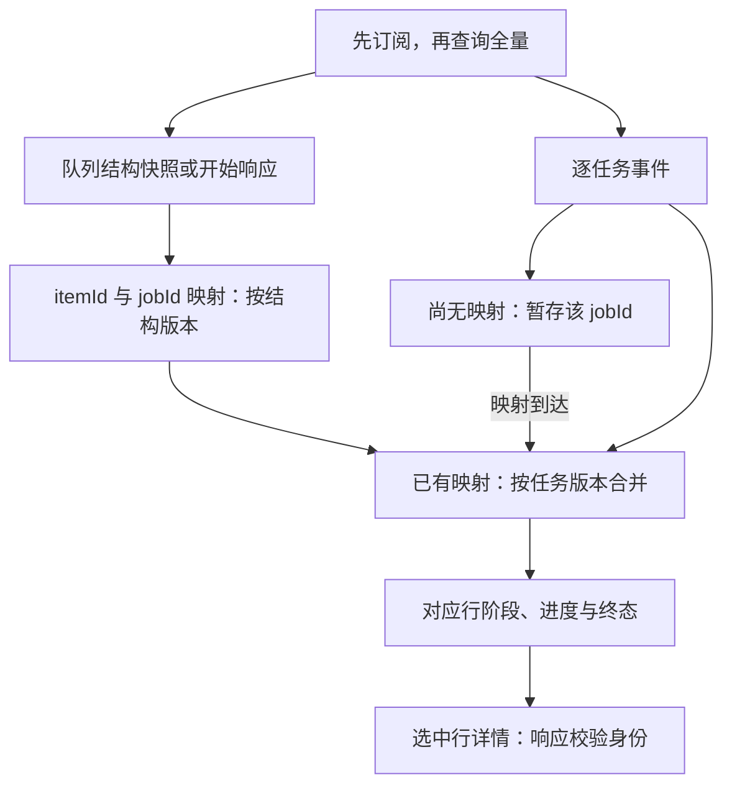

# Folder Import and Per-file Progress - Plan

## Goal Capsule

- **Objective:** 桌面用户可以一次导入一批本地视频，自动处理并分别确认每个文件的进度与结果。
- **Means:** 由现有 Rust 任务服务管理队列，沿用逐文件转换与清理流程（KTD1、KTD4）。
- **Product authority:** 本文记录 2026-10-06 用户确认的批量行为；原设计的单文件与单任务限制由 R1、R9 取代，其余媒体及文件保护规则按 R17 继承。
- **Execution profile:** U1–U5 按依赖实施；并发与状态合并先建立行为测试，Windows 安装后验证按 Verification Contract 执行。
- **Completion owner:** 实施者完成代码、自动验证和 Windows x64 安装包证据；桌面交互由用户按验收文档确认。
- **Stop conditions:** 媒体保护规则或产品范围出现冲突时，先报告具体冲突；尚未取得的 Windows 运行证据不得记为通过。
- **Open blockers:** 无待用户决定的产品问题。

---

## Product Contract

### Summary

在现有视频工作台增加文件夹导入和待处理列表。
软件按固定并发队列处理列表，每个文件分别显示阶段、进度和结果。
单项失败或取消不会阻断其他文件。
实施沿用既有转换流程，由后端管理队列，并补充 Windows 安装后的批量验证。

### Problem Frame

现有软件一次选择一个视频，界面围绕一个任务展示进度。
用户处理同一文件夹中的多个视频时，需要反复导入、等待和启动，也无法在同一列表核对多个文件的结果。

### Key Decisions

- **文件夹范围按 R1 执行。** Governs R1. (session-settled: user-directed — chosen over recursive import: user selected the current folder only.)
- **采用固定并发队列。** Governs R8, R9. (session-settled: user-directed — chosen over serial processing: user explicitly chose two simultaneous files.)
- **隔离单项失败。** Governs R10, R16. (session-settled: user-directed — chosen over pausing further dispatch: user chose to continue other files.)
- **取消操作针对单个文件。** Governs R11, R12. (session-settled: user-directed — chosen over whole-batch cancellation or both controls: user chose individual cancellation.)
- **运行期间固定批次输入与设置。** Governs R3, R4, R5. (session-settled: user-approved — chosen over editing an active batch: user confirmed editing before start and locking the batch afterward.)
- **共享配置按 R6、R7 执行。** 沿用现有配置入口，避免本次扩展引入逐文件参数编辑。

### Requirements

**Import and list**

- R1. 文件夹导入只收集所选目录当前层的 MP4 文件，扩展名匹配不区分大小写。
- R2. 导入时先展示文件列表，完整媒体检查随对应处理任务执行。
- R3. 开始前可以继续追加文件夹内容，同一文件路径在列表中只保留一个条目。
- R4. 批次尚未运行或已经结束时允许移除列表条目，移除操作不删除源文件。
- R5. 批次运行期间禁止新增或移除条目及修改处理设置，逐文件取消按 R11、R12 执行。

**Batch settings and execution**

- R6. 本批共用一个输出目录、处理预设和元数据策略。
- R7. 元数据默认分别保留各输入的标题与备注，启用自定义时将填写内容应用于本批所有待处理文件。
- R8. 用户点击开始后自动调度当前列表的待处理项，重复点击及既有终态项不得造成重复执行。
- R9. 队列自动填满最多 2 个并发名额，名额覆盖检查、准备、转换、校验、保存和取消中的完整任务生命周期。
- R10. 单个文件失败后记录原因并继续调度其他待处理文件，不自动重试失败项。

**Individual cancellation**

- R11. 用户取消尚未开始的文件后，该条目标记为已取消且不再启动。
- R12. 用户取消活动文件后，该任务按 R17 停止并释放资源才交还并发名额，其他文件继续处理。

**Progress and results**

- R13. 列表按文件分别显示可辨识的名称或路径、阶段和进度，状态包含待处理、检查、准备、处理中、校验、保存、正在取消及对应终态。
- R14. 无法测得百分比的阶段显示阶段名称，不伪造进度数值。
- R15. 每个文件只有在校验及正式保存成功后才显示完成和 100%。
- R16. 每个条目保留对应结果及输出定位或错误日志入口，后续任务及迟到事件不得改写已有终态。

**Compatibility and lifecycle**

- R17. 每个文件继承 `docs/superpowers/specs/2026-10-02-video-processing-desktop-design.md` 的 §3 输入契约、§3.1 预设、§5 输出及输入身份规则、§6 取消与完整校验，批量交互和调度以本文为准。
- R18. 选择空文件夹或无法访问的文件夹时提供明确反馈，取消选择或导入失败不破坏已有列表。
- R19. 现有单视频选择和单视频拖入继续可用，并通过同一列表处理。
- R20. 关闭软件时停止调度后续文件，并按 R17 的退出及清理规则处理所有活动任务。
- R21. 本功能的交付与验收覆盖 Windows x64 桌面软件。

### Key Flows

列表中的文件名、阶段和进度位于同一条目，对应取消和结果操作跟随该条目（R11–R16）。

- F1. 导入并处理
  - **Trigger:** 用户选择输入文件夹。
  - **Steps:** 按 R1–R4 建立列表；配置 R6、R7；点击开始后按 R8、R9 调度；每项按 R13–R17 显示结果。
  - **Outcome:** 用户在同一列表核对各文件的独立进度及终态。

- F2. 单项失败或取消
  - **Trigger:** 某个文件失败，或用户取消指定条目。
  - **Steps:** 失败按 R10 处理；待处理项按 R11 取消；活动项按 R12 停止；释放名额后继续 R9 的调度。
  - **Outcome:** 受影响条目保留自身结果，其他条目的进度和结果不被覆盖。

- F3. 批次结束后的再次处理
  - **Trigger:** 当前批次所有活动及待处理条目均进入终态。
  - **Steps:** 保留结果供查看；按 R3、R4 整理列表；需要再次尝试的文件先移除原条目再重新导入；点击开始只启动 R8 定义的待处理项。
  - **Outcome:** 用户可以显式启动下一批，成功、失败及取消项均不会自行重跑。

### Acceptance Examples

以下示例在 R21 定义的交付范围验证。

- AE1. 当前层文件筛选。 **Covers R1, R2, R18.**
  - **Given:** 文件夹中有 `a.mp4`、`b.MP4`、`note.txt` 和子文件夹中的 `c.mp4`。
  - **When:** 用户选择这个文件夹。
  - **Then:** 列表只追加前两个视频，并先显示待处理状态；选择空目录、无权限目录或取消选择不清空已有列表。

- AE2. 追加、去重和移除。 **Covers R3, R4, R13.**
  - **Given:** 列表已有一个文件夹的条目，另一个文件夹含有同名但路径不同的视频。
  - **When:** 重复导入第一个文件夹，再追加第二个文件夹，随后移除一项。
  - **Then:** 同一路径不会重复入队，不同路径的同名文件可以区分，移除项的源文件仍然存在。

- AE3. 并发名额和防重复启动。 **Covers R5, R8, R9.**
  - **Given:** 列表有四个待处理视频。
  - **When:** 用户开始处理并重复点击开始，其中一项从转换进入校验。
  - **Then:** 最初两项同时执行，后两项等待；校验阶段不会提前让第三项占用名额，资源释放后自动补入下一项，单项不会重复启动，列表和设置保持固定。

- AE4. 单项失败后继续。 **Covers R9, R10, R16, R17.**
  - **Given:** 待处理视频中有一个损坏或无法读取的 MP4。
  - **When:** 对应任务检查或处理失败。
  - **Then:** 该行显示自身失败原因和日志入口，其他文件继续调度，失败项不会自动重试或显示成功输出。

- AE5. 取消待处理项。 **Covers R9, R11.**
  - **Given:** 两项活动任务之外还有两项等待。
  - **When:** 用户取消其中一个等待项。
  - **Then:** 被取消项不会启动或生成输出，其他活动项及未取消的等待项继续执行。

- AE6. 取消活动项。 **Covers R9, R12, R16, R17.**
  - **Given:** 两个文件正在处理，列表中还有等待项。
  - **When:** 用户在可取消阶段取消其中一个活动文件。
  - **Then:** 该行先显示正在取消，资源释放后才补入下一项，另一活动文件的进度不受影响；进入不可取消的保存阶段时沿用 R17 的真实状态。

- AE7. 独立进度与完成判定。 **Covers R6, R7, R13, R14, R15, R16, R17.**
  - **Given:** 两个任务处于不同阶段，且默认元数据来自不同输入。
  - **When:** 一项结束转换并进入校验，另一项仍在处理，随后到达延迟的旧进度事件。
  - **Then:** 两行保持各自阶段和进度，无法计算百分比的阶段显示阶段名称；未完成校验与保存的项不显示 100%，成功结果各自可定位、默认元数据各自保留，旧事件不改写终态或串到另一行。

- AE8. 显式再次尝试。 **Covers R3, R4, R8, R10.**
  - **Given:** 当前列表的所有条目均已成功、失败或取消。
  - **When:** 用户再次点击开始，随后移除一个失败条目、重新导入该文件并开始。
  - **Then:** 没有待处理项时不会重跑既有结果，重新导入的条目才成为新的处理对象。

- AE9. 软件退出。 **Covers R17, R20.**
  - **Given:** 软件存在活动任务及等待项。
  - **When:** 用户关闭软件。
  - **Then:** 不再启动等待项，所有活动任务按既有退出规则收尾，已保存结果和源文件保留。

- AE10. 原有单文件入口。 **Covers R8, R13, R15, R16, R17, R19.**
  - **Given:** 当前没有活动批次。
  - **When:** 用户通过原有选择视频按钮或单文件拖入添加视频并开始。
  - **Then:** 视频进入同一列表，仍可查看阶段、取消任务、查看错误日志或定位已校验保存的结果。

- AE11. 共享配置与自定义元数据。 **Covers R5, R6, R7, R17.**
  - **Given:** 两个待处理视频的原始标题与备注不同。
  - **When:** 用户选择一个输出目录及预设，填写统一自定义标题与备注并开始处理。
  - **Then:** 两个结果使用本批冻结的目录、预设和填写内容，运行期间不能改动这些设置。

### Scope Boundaries

- 不递归导入子文件夹，范围由 R1 定义。
- 不新增整批取消、可调并发数或运行中动态追加队列。
- 不增加自动重试、重启后的批次续跑或完整批次历史页。
- 不增加逐文件预设及元数据编辑界面。
- 本次不扩展输入格式、转换预设、GPU 加速或平台自动上传；媒体边界按 R17 执行。
- 本次不增加 macOS、Linux 或其他 Windows 架构的安装包，交付范围由 R21 定义。

### Sources / Research

- `docs/superpowers/specs/2026-10-02-video-processing-desktop-design.md:30`：原输入契约和单文件范围；`:82`：既有生命周期；`:94`：取消及输出校验。
- `src/api/desktop.ts:24`：当前输入选择为单个 MP4；`:29`：现有输出目录选择。
- `src/features/processing/useProcessing.ts:25`：当前任务引用及按任务合并快照；`:69`：单文件拖入行为。
- `src/features/processing/ProcessingView.tsx:48`：输入区域；`:63`：当前任务进度区域，可作为交互延续的依据。
- `src-tauri/src/jobs/service.rs:146`、`:491`：现有任务启动受单活动任务约束，规划需支持 R9。
- `src-tauri/src/jobs/progress.rs:19`、`src-tauri/src/jobs/service.rs:382`：当前进度与成功保存后的完成判定。
- `docs/opendesign/index.html`：用户此前指定的界面风格参考。

---

## Planning Contract

**Product Contract preservation:** R1–R21、Key Decisions、F1–F3、AE1–AE11 与 Scope Boundaries 保持不变；Summary 仅补充已确认的实施方向。

### Key Technical Decisions

- KTD1. **队列和活动任务由 JobService 统一拥有。** 在 `src-tauri/src/jobs/service.rs` 将单个 `active` 改为按任务 ID 索引的活动集合，并加入本进程内的队列及冻结配置。
  同一状态锁仲裁导入、开始、取消、名额预留和关闭；等待媒体进程、目录扫描及事件发送均在锁外执行。
  该选择落实 R5、R8–R12、R20，避免界面重挂载或重复调用产生另一套调度状态。
  (session-settled: user-approved — chosen over frontend-owned dispatch: user confirmed backend ownership to prevent extra task starts.)

- KTD2. **文件夹选择复用 dialog，收集与去重在 Rust 完成。** `src/api/desktop.ts` 使用现有目录选择能力，新增收集模块只枚举 R1 定义的范围，不在导入时调用媒体检查（R2）。
  对可列出的 MP4 路径建立绝对路径键，优先使用规范路径，并处理 Windows 路径别名；规范化失败但仍可列出的文件保留为待检查项，不因此跳过该文件。
  目录扫描在 `spawn_blocking` 中完成，返回后重新检查 R5 和关闭状态，再一次性合并条目；目录级失败保留原列表，反馈按 R18 执行。
  [Tauri dialog 官方文档](https://v2.tauri.app/reference/javascript/dialog/)提供目录选择，`recursive` 描述权限范围，并不实现本次文件扫描。
  已启动的阻塞任务不能依靠取消 JoinHandle 停止，因此必须检查迟到的扫描结果是否仍可应用。[Tokio spawn_blocking](https://docs.rs/tokio/latest/tokio/task/fn.spawn_blocking.html)

- KTD3. **新增队列契约，保留既有 JobSnapshot 与单任务 API。** 队列条目以稳定 `itemId` 关联路径、待处理状态及可选 `jobId`；实际任务仍使用现有阶段和快照。
  不向 `JobState` 插入排队状态，不为尚未启动的文件伪造 `startedAtMs`。
  旧 `start_job` 和检查入口保持独占语义，在批次活动期间返回现有 Busy 错误；新界面通过批次命令执行 R8、R19。
  空队列时可以继续展示既有“上次结果”，但历史结果不会自动变成待处理项。
  依据：`src-tauri/src/contracts/job.rs`、`src/api/contracts.ts`、`src-tauri/tests/wire_contract.rs` 及原单任务防重复启动测试。

- KTD4. **每个活动条目复用现有完整执行与收尾流程。** 每项单独持有取消和完成信号、事件通道、进度解析器、日志及工作目录；保留现有输入身份校验、无覆盖发布和保存阶段的取消边界（R17）。
  统一收尾入口在原进程及事件读任务结束、清理完成或记录 `cleanupPending` 后写入终态，再移除该活动、预留下一个条目，最后在锁外发事件并启动后续任务（R9、R12、R15）。
  预留时即登记取消和完成信号；关闭先于任务实际启动到达时，该项仍进入统一收尾并发送完成信号，不能遗留无人完成的活动。
  取消待处理项不创建实际任务；活动项的取消响应由服务真实状态决定，禁止前端提前改成已取消（R11、R12）。
  现有 NativeRunner 已逐次拥有子进程，不增加另一套媒体执行器。
  (session-settled: user-approved — chosen over replacing the media pipeline: user confirmed reusing the existing conversion and cleanup flow.)

- KTD5. **先关闭调度，再取消并等待所有活动。** `shutdown` 在状态锁内设置 `closing`、停止补位并取得所有活动的完成信号，随后在锁外按现有取消策略处理并等待每项结束（R20）。
  保存中的任务继续按 R17 收尾，保留 `main.rs` 的关闭窗口与退出事件防重入逻辑。
  取消请求只是通知，任务还可能执行清理；现有完成信号可以证明它们已经结束。[Tokio graceful shutdown](https://tokio.rs/tokio/topics/shutdown)

- KTD6. **结构事件与逐任务进度分别合并。** 新 `queue_snapshot` 事件及全量查询携带队列结构版本；现有 `job_snapshot` 按 `jobId` 和任务版本更新对应条目。
  前端先订阅再查询全量，按各自版本合并；暂未收到条目映射的任务事件暂存，并合并一次全量查询，映射到达后再合并。
  查询后仍无映射的任务事件丢弃，不能把未知任务绑定到当前选中行或持续积累旧任务缓存。
  全量查询和开始响应不得回退较新的任务快照，终态保持 R16 的保护；移除条目后清除相关缓存。
  日志、结果定位和媒体详情绑定条目及任务身份，切换行或卸载后丢弃迟到的详情响应。
  检查成功的 `MediaInfo` 可在队列条目中展示；完整检查仍由对应活动任务执行（R2），导入后显示“待检查”。

- KTD7. **共享配置按批次冻结，元数据仍逐输入计算。** 批次开始时复制输出目录、预设及 `MetadataRequest`，为每个实际任务生成现有 `StartJobRequest`（R5–R7）。
  preserve 模式沿用该任务检查得到的输入元数据，override 模式复制本批填写内容，不使用某一选中视频的标题代替其他输入。
  输出和工作目录继续使用现有任务 ID 命名策略，不按列表文件名覆盖结果（R17）。

- KTD8. **保留逐任务历史写入，队列只存在于当前进程。** 原有每任务记录与 `latest.json` 写入先保持串行，避免同时结束时改写同一历史文件的竞态。
  同一进程的界面重挂载通过全量查询恢复队列；软件重启只沿用既有历史及清理策略，不恢复批次调度。
  不扩展历史页或持久化队列，遵守 Product Contract 的 Scope Boundaries。

- KTD9. **以确定性测试证明并发，再验证实际媒体与安装后的工具。** 测试 runner 使用按输入区分的阻塞点，证明两个任务同时进入执行、第三项在名额释放前未启动，并覆盖各文件的事件隔离。
  随后使用 NativeRunner 与 Windows 已安装工具验证真实转换；CI 安装检查与用户桌面验收分别提供证据（R21）。
  (session-settled: user-approved — chosen over mock-only verification: user confirmed actual video processing after Windows installation.)

### High-Level Technical Design

以下图表说明 KTD1–KTD9 的组件、状态及交互；具体辅助函数名称由实现决定。

#### Component Relationships

#### Service Ownership

#### Queue and API Shapes

| 契约或操作 | 内容与职责 | 规则归属 |
|---|---|---|
| 队列快照 | 结构版本、运行标记、有序条目 | KTD3、KTD6 |
| 队列条目 | itemId、输入路径与显示名、待处理或未启动取消标记、可选 jobId/JobSnapshot/MediaInfo | KTD2、KTD3、KTD6 |
| 导入文件夹 | 接收所选目录，收集后原子追加并返回队列及导入反馈 | KTD2 |
| 追加单个输入 | 选择或拖入的路径使用相同去重与队列入口 | KTD2、KTD3 |
| 移除条目 | 按 itemId 移除，源文件不变 | R4、KTD1 |
| 开始批次 | 接收共享配置，只选择待处理项并返回实际队列状态 | R8、KTD1、KTD7 |
| 取消条目 | 待处理项就地取消；已关联任务走原任务取消流程 | KTD4 |
| 全量查询与结构事件 | 提供映射和结构版本，不随每一帧进度发送整张列表 | KTD6 |
| 原任务查询、日志和定位 | 按真实 jobId 查询，未启动条目不借用其他任务的结果 | KTD3、KTD6 |

#### Operation Gates

| 操作 | 批次未运行或已结束 | 批次运行中 | closing 后 |
|---|---|---|---|
| 导入或移除 | 按 R3、R4 允许 | 按 R5 拒绝 | 拒绝 |
| 修改共享配置 | 允许 | 按 R5 锁定 | 禁用 |
| 开始批次 | 按 R8 启动待处理项 | 不创建重复任务 | 拒绝 |
| 取消指定条目 | 待处理项按 R11；终态返回真实状态 | 按 R11、R12 | 由退出流程收尾 |
| 自动补位 | 尚未开始时不补位 | 按 R9 | 按 R20 停止 |
| 旧检查或直接启动 API | 保持旧独占约束 | Busy | Busy |
| 查询、日志、结果定位 | 绑定真实条目或任务 | 同左 | 退出前保持只读 |

#### Item State

图中省略的逐任务转移沿用 R17；`LinkedJob` 内部阶段来自 JobSnapshot，队列不维护第二套实际任务状态。

#### Dispatch Decisions

预留完成后才在锁外启动任务；选择的条目在同一次状态变更中离开待处理状态（KTD1、KTD4）。

#### Cancellation and Slot Release

#### Shutdown Protocol

#### Frontend Data Flow

### System-Wide Impact

任务基数从一项变为多个，原有“当前任务”引用不再决定列表内容；日志、结果及输入详情都需要明确条目身份（KTD3、KTD6）。
目录选择继续使用已启用的 dialog 插件，不增加文件系统插件或扩大权限能力。
两个活动任务增加 CPU、磁盘和内存负载，固定并发按 R9 执行，不由此增加自动调参或新并发选项。

### Risks and Implementation Notes

| 风险或实现边界 | 对应处理与证据 |
|---|---|
| 校验、取消或清理尚未结束就补位 | KTD4；U2 阻塞点测试及 U5 实际取消验证 |
| 扫描返回时批次已开始或应用正关闭 | KTD2；U1/U2 迟到导入测试 |
| 事件先于开始响应，或查询回包晚于新进度 | KTD6；U3 顺序交错与重挂载测试 |
| 同名文件、Windows 路径大小写及中文路径 | KTD2、KTD7；U1 路径测试和 U5 已安装工具验证 |
| 同时结束改写 latest.json | KTD8；U2 同时终态后历史可读测试 |
| 磁盘不足、媒体损坏或校验失败 | 继承 R17；U2 隔离失败，U5 延用现有媒体回归 |
| 原检查详情随任务后移 | KTD6；U4 验证待检查提示及选中行媒体信息 |

辅助函数和批次命令的最终名称可随现有模块组织调整，但 KTD3 的兼容性和 KTD6 的版本归属不变。
关闭及单项取消沿用现有 FFmpeg 退出宽限和强制终止实现，不新增统一超时承诺。

---

## Implementation Units

### U1. Input Collection and Queue Contracts

**Goal:** 建立轻量文件夹收集与跨 Rust/TypeScript 的队列数据契约。

**Requirements:** R1–R4、R13、R18、R19；F1、F3；AE1、AE2、AE8、AE10。

**Dependencies:** 无。

**Files:** 新增 `src-tauri/src/media/inputs.rs`、`src-tauri/src/contracts/batch.rs`、`src-tauri/tests/input_collection.rs`、`tests/fixtures/queue-snapshot.json`；修改 `src-tauri/src/media/mod.rs`、`src-tauri/src/contracts/mod.rs`、`src/api/contracts.ts`、`src-tauri/tests/wire_contract.rs`。

**Approach:**

1. 按 KTD2 分离目录收集和路径去重键，提供收集结果及空目录反馈，复用现有错误契约。
2. 按 KTD3 定义队列快照、条目及批次共享配置，保留实际任务快照格式。
3. 建立新队列 fixture，同时保留原 `job-snapshot.json` 的兼容验证。

**Patterns to follow:** 现有 contracts 的 camelCase 序列化、媒体模块的 AppError 处理、`wire_contract.rs` 的 fixture 校验。

**Execution note:** 先用临时目录建立收集和路径去重的行为证据，再接入任务服务。

**Test scenarios:**

- Covers AE1. 同层 `a.mp4`、`b.MP4`、文本文件及子目录中的 MP4，只收集同层两个候选且不运行 probe。
- Covers AE1. 空目录返回明确空结果，目录不存在或枚举失败返回错误，不生成部分成功列表。
- Covers AE2. 重复选择相同目录及等价路径不产生重复候选，不同目录的同名文件保持两项。
- 可列出的 MP4 后续无法读取时仍可进入待检查项，完整媒体错误留给任务执行。
- Windows 测试覆盖大小写、路径分隔符及规范路径别名；中文与空格路径不被拆分。
- 新 fixture 的待处理、未启动取消和已关联实际任务均能 round-trip，旧 JobSnapshot fixture 保持一致。

**Verification:** 输入收集测试与两组 wire fixture 通过；导入阶段没有媒体进程调用。

### U2. Concurrent Scheduling and Lifecycle

**Goal:** 在 JobService 中实现受同一状态管理的双活动队列及独立收尾。

**Requirements:** R3–R12、R15–R17、R20；F1–F3；AE2–AE9、AE11。

**Dependencies:** U1。

**Files:** 修改 `src-tauri/src/jobs/service.rs`、`src-tauri/tests/job_lifecycle.rs`、`src-tauri/tests/support/controlled_runner.rs`；新增 `src-tauri/tests/batch_lifecycle.rs`。

**Approach:**

1. 按 KTD1 加入队列、冻结配置和活动索引，导入合并及条目移除接受同一运行状态检查。
2. 按 KTD4 将启动与最终收尾接入统一调度入口，保存每项的输入检查结果及实际任务关联。
3. 按 KTD7 生成各任务请求，按 KTD8 保留逐任务历史串行写入。
4. 按 KTD5 扩展关闭逻辑，保留旧单任务入口的独占约束（KTD3）。
5. 为结构变化生成 KTD6 的版本与事件，事件发送不持有服务锁。

**Patterns to follow:** 原 `execute`、`cancel_job`、`shutdown`、`release_activity`，以及 terminal 回调可启动后续任务的回归约束。

**Execution note:** 先扩展 runner 的按输入阻塞点，建立调度、收尾与取消的失败测试；不要用固定 sleep 推断并发成立。

**Test scenarios:**

- Covers AE3. 四项入队，两个任务均进入可观测阻塞点，第三项尚未启动；释放一项后第三项自动进入，同一输入只启动一次。
- Covers AE3. 一项停在完整校验，另一项仍活动，第三项保持等待；转换进程结束不提前交还名额。
- Covers AE3 / AE11. 连续开始调用和晚到导入均不能改变已冻结列表及配置，默认或 override 请求分别传给各输入。
- Covers AE4. 一个 probe 或 run 失败，另一项及后续项继续执行，失败项保留自身错误与日志且没有重试。
- Covers AE5. 等待项被取消后未调用 runner、没有输出，其他项照常补位。
- Covers AE6. 活动项取消后阻塞在进程或清理收尾，等待项不补位；完成信号后才启动下一项。
- Covers AE6. 保存阶段的取消返回真实状态，结果最终只有一个终态，不错误改为已取消。
- Covers AE7. 各项输入元数据、进度、输出、错误和日志保持各自归属，终态之后的旧事件不能改写结果。
- Covers AE8. 全部终态后开始不重跑，移除再导入产生新的条目及任务身份，源文件未删除。
- Covers AE9. 两项活动及等待项同时存在时关闭，所有活动收尾且没有新 runner 调用；hung probe 的原退出回归仍通过。
- 关闭先于已预留任务实际启动到达时，该任务完成取消收尾且不进入媒体执行，shutdown 不因未发送完成信号而挂起。
- 两项同时结束时历史 JSON 均可读，终态事件回调重入查询或启动不会死锁，旧 double_start 的 Busy 行为保持。
- 原清理失败的 `cleanupPending`、日志限长及输入身份保护测试保持有效。

**Verification:** 同时执行的正向证据、名额上限与全生命周期占用均成立；旧单任务生命周期回归通过。

### U3. Desktop Commands and Queue State

**Goal:** 通过桌面 API 将多条目状态可靠地提供给界面。

**Requirements:** R1–R3、R5、R8、R11–R16、R18、R19；F1–F3；AE1、AE3、AE5–AE8、AE10。

**Dependencies:** U1、U2。

**Files:** 修改 `src-tauri/src/commands.rs`、`src-tauri/src/main.rs`、`src/api/desktop.ts`、`src/features/processing/useProcessing.ts`；新增 `src/features/processing/queueState.ts`、`src/features/processing/queueState.test.ts`、`src/features/processing/useProcessing.test.tsx`。

**Approach:**

1. 注册 KTD3 的批次命令、队列查询与结构事件，保留原命令和桌面退出接入。
2. 在 DesktopApi 增加文件夹选择与队列操作；选择文件、选择文件夹和拖入路径都通过同一输入收集入口。
3. 按 KTD6 将单 `jobId` 引用改为条目映射和逐任务版本合并，并绑定选中项的详情请求。
4. 使用 KTD3 的既有历史查询展示上次结果，避免将它加入新队列。

**Patterns to follow:** 现有订阅 disposer、挂载 generation 检查、`deferred()` 测试工具，以及 jobId 绑定的日志和输出命令。

**Execution note:** 先测事件顺序交错和卸载后的响应，再接入视图；实际 Tauri 桥接由 U5 验证。

**Test scenarios:**

- Covers AE1. 目录选择返回 null 时不调用导入，导入空结果或失败时已有条目保留。
- Covers AE7. A/B 的进度交错，旧版本、终态后的新进度、未知旧任务事件均不会串行或覆盖结果。
- Covers AE3 / AE7. job 事件先于开始响应或结构映射、查询先返回旧状态，最终每行仍得到自身最新快照。
- Covers AE8. 移除再导入相同路径后，原 jobId 的迟到事件不能影响新 itemId。
- Covers AE7. 查看 A 日志后切到 B，A 的迟到回包不替换 B 详情；未启动取消项不请求其他任务日志。
- 重挂载先订阅再查询，恢复同一进程的队列；卸载及时释放所有订阅，迟到 disposer 不留下监听。
- Covers AE10. 单文件选择及拖入均调用队列入口；既有历史结果仍标注“上次结果”且不会自动执行。
- 每个新增命令的错误均返回现有 AppError 契约，导入不要求启动媒体工具，开始及输出定位保留原工具和结果检查。

**Verification:** 类型检查、状态合并及 hook 测试通过；新增命令在 desktop feature 下编译，并可通过 Tauri 获取队列及对应日志。

### U4. Per-file Processing Interface

**Goal:** 用户在一个列表内查看、取消和核对各文件，同时设置本批共享参数。

**Requirements:** R2–R8、R11–R16、R18、R19；F1–F3；AE1–AE3、AE5–AE8、AE10、AE11。

**Dependencies:** U3。

**Files:** 修改 `src/features/processing/ProcessingView.tsx`、`src/features/processing/processing.css`、`src/features/processing/ProcessingView.test.tsx`。

**Approach:**

1. 按 R13 将输入区域改为有序文件列表；同名项展示路径区别，每行提供自身阶段、进度及允许的操作。
2. 选中项详情接入 KTD6，检查前显示待检查，检查后沿用原媒体信息及色彩信息提示。
3. 保留共享输出、预设和元数据入口，运行锁定按 R5 执行；开始按钮根据待处理项与共享配置判断可用性。
4. 各行取消及结果入口按 KTD4 绑定真实任务，批次结束后保留列表供 F3 整理。
5. 沿用 `docs/opendesign/index.html` 的工作台风格和现有响应式布局，列表支持滚动、键盘操作及含文件名的进度标签。

**Patterns to follow:** 原界面阶段文案、错误日志、结果定位和媒体信息展示；不扩展逐文件参数或整批取消入口。

**Test scenarios:**

- Covers AE2. 多项及同名项可辨识，移除只改变该行；开始后导入、移除和共享设置均禁用。
- Covers AE3 / AE7. 两行处于不同阶段，第三行等待；未知百分比显示阶段，校验及保存未完成时不出现 100%。
- Covers AE5 / AE6. 点击某行取消只操作该 itemId，等待项显示已取消，活动项依次显示真实取消阶段及终态。
- Covers AE4 / AE7. 成功行提供对应输出定位，失败行提供对应原因与日志，选择另一行后旧详情不覆盖当前行。
- Covers AE8 / AE10. 没有待处理项时开始不可用，重新导入后只启动新项，单文件选择和拖入保留完整操作链。
- Covers AE11. preserve 与 override 的共享编辑状态正确，运行中不允许修改，待检查输入不阻挡列表展示。
- 检查后仍显示原媒体详情及“不声称补齐缺失色彩信息”的提示；1280×840 与现有窄布局中列表及操作不互相遮挡。

**Verification:** 视图测试通过，桌面人工检查可以对应每行识别输入、状态、取消和结果，原单文件入口仍可完成处理。

### U5. Native Batch and Windows Validation

**Goal:** 用实际媒体及 Windows x64 安装后的工具验证完整批量行为。

**Requirements:** R1–R21；F1–F3；AE1–AE11。

**Dependencies:** U2、U4。

**Files:** 新增 `src-tauri/tests/batch_real.rs`；修改 `scripts/check-media.mjs`、`.github/workflows/windows-x64.yml`、`docs/windows-desktop-acceptance.md`；必要时复用 `src-tauri/tests/support` 中现有真实工具定位辅助函数。

**Approach:**

1. 按 KTD9 建立实际 batch 测试，沿用环境变量定位准备好的或已安装的工具。
2. 在临时目录复制 `docs/requirements/20261002-research/原视频.mp4` 并生成所需媒体 fixture，形成不同路径、中文或空格名及失败输入；输入源不改写。
3. 将新 batch 测试加入原媒体回归和 Windows 安装后测试步骤，保留原流水线、取消及资源校验。
4. 更新桌面验收文档，用可逐行核对的步骤覆盖全部 AE，并附输出和输入保护检查。

**Execution note:** 使用真实工具证明转换和收尾，CI 静默安装只能证明安装及工具运行，桌面交互需 Windows 人工验收。

**Test scenarios:**

- Covers AE3 / AE7 / AE11. 至少三个真实输入走队列，观察两个活动任务和后续补位，分别完成既有完整校验与发布；各输入哈希不变，默认和覆盖元数据分别正确。
- Covers AE4. 损坏 MP4 和有效输入同批执行，有效结果完成校验，失败项没有成功输出且后续项继续。
- Covers AE5 / AE6. 取消一个等待项和一个实际转换项，其他输入成功，已取消项不发布结果，等待项补位不早于活动项收尾。
- Covers AE9. 原退出验证扩展到两个活动任务，关闭后没有残留媒体子进程，已保存输出和源文件保留。
- Covers AE1 / AE2 / AE10. 已安装 Windows 桌面选择文件夹、追加目录和单文件入口，筛选、路径去重、中文路径及同名项显示符合产品约定。
- 已安装工具执行新 batch 测试及原 generated/provided_sample 回归；安装资源校验、desktop clippy 和 NSIS 构建继续通过。

**Verification:** 实际媒体及已安装工具测试通过，Windows 安装包、CI 日志和用户桌面验收结果均可追溯至同一源码提交。

---

## Verification Contract

以下命令供实施后执行，不代表规划阶段已运行。
本地先安装锁定依赖并准备当前平台 sidecar；Windows 验证使用既有 CI 的 `x86_64-pc-windows-msvc` 工具及安装资源。

### Automated Gates

| 验证范围 | 命令或既有入口 | 通过条件 |
|---|---|---|
| 类型与前端构建 | `npm run typecheck`；`npm run build` | U1、U3、U4 契约及界面无类型或构建错误 |
| 前端行为 | `npm test -- --run` | U3、U4 的版本、映射、详情及操作测试和既有回归通过 |
| Rust 收集、wire 与调度 | `cargo test --locked --manifest-path src-tauri/Cargo.toml` | U1、U2 和既有非 ignored 回归通过 |
| Rust 格式 | `cargo fmt --manifest-path src-tauri/Cargo.toml -- --check` | 修改符合现有格式 |
| Desktop 集成 | `cargo clippy --locked --manifest-path src-tauri/Cargo.toml --all-targets --features desktop -- -D warnings` | 新命令和事件在真实 desktop feature 下编译通过 |
| Sidecar 与发布校验器 | `npm run test:sidecars`；`npm run test:release` | 原工具准备和安装资源检查无回归 |
| 实际媒体回归 | `npm run test:media -- --sample-dir docs/requirements/20261002-research` | 原测试及 U5 新增批量测试通过，不跳过样例验证 |
| 独立批量真实测试 | `cargo test --locked --manifest-path src-tauri/Cargo.toml --test batch_real -- --ignored --test-threads=1` | 准备好的 fixture 下证明真实转换、取消和输出验证 |
| Windows x64 构建及安装 | `.github/workflows/windows-x64.yml` 的既有构建、clippy、静默安装与资源步骤 | 产出可安装 NSIS，已安装资源校验通过 |
| Windows 已安装工具 | 设置既有 `VIDEO_EDITOR_INSTALLED_EXE`、`VIDEO_EDITOR_FIXTURE_DIR` 后执行 batch_real 及原 pipeline_real/lifecycle_real 步骤 | 使用安装资源完成新批量和原媒体回归，保留 CI 证据 |

`batch_real` 是 U5 新增的目标；准备好的工具与 fixture 为执行前提，Windows 工作流继续使用既有 `--locked` 和 MSVC 目标参数。
本仓库使用 `scripts/verify-release.mjs` 校验安装资源，没有要求新增 `release:validate` 命令。

### Acceptance Coverage

| 验收示例 | 首要实施单元 | 证据 |
|---|---|---|
| AE1 | U1、U3、U4 | 当前层筛选、空目录与取消选择测试；Windows 目录选择 |
| AE2 | U1、U2、U4 | 路径去重、移除、同名项及源文件检查 |
| AE3 | U2、U3、U4、U5 | 双任务进入阻塞点、校验占位、防重复启动；真实转换 |
| AE4 | U2、U4、U5 | 失败隔离及真实损坏输入，按行显示原因 |
| AE5 | U2、U4、U5 | 等待取消无 runner 调用或输出 |
| AE6 | U2、U4、U5 | 收尾阻塞点、真实取消和保存阶段边界 |
| AE7 | U2、U3、U4、U5 | 元数据与输出校验、事件乱序、逐行进度及详情 |
| AE8 | U2、U3、U4 | 不自动重跑、重新导入身份、旧事件隔离 |
| AE9 | U2、U5 | 全活动关闭测试、真实子进程清理 |
| AE10 | U3、U4、U5 | 选择和拖入测试；Windows 单文件完成链 |
| AE11 | U2、U4、U5 | 冻结设置与各结果自定义元数据 |

### Windows Desktop Evidence

由用户按 `docs/windows-desktop-acceptance.md` 在已安装的 Windows x64 应用确认 AE1–AE11。
记录安装包名称与哈希、源码提交、系统版本、各步骤结果及必要的截图或日志，不能以 CI 静默安装代替交互验收。
检查原视频及测试输入哈希、对应输出定位、独立错误日志和关闭后的进程情况。

---

## Definition of Done

### Per-unit Completion

| 单元 | 完成条件 |
|---|---|
| U1 | 当前层输入收集和去重测试通过，新队列契约及原 wire 契约均可读 |
| U2 | 队列正向并发、全生命周期占位、取消隔离及全活动退出有确定性证据 |
| U3 | 队列命令可用，事件及详情归属正确，订阅卸载和重挂载测试通过 |
| U4 | 每行可核对状态和结果，运行设置锁定，原入口与媒体详情回归通过 |
| U5 | 实际批量测试、Windows 已安装工具回归及桌面验收证据齐全 |

### Global Completion

- R1–R21 通过 Verification Contract 对应证据成立，AE1–AE11 均有明确结果。
- 继承 R17 的原输入保护、完整校验、安全发布与清理检查继续通过。
- U1–U5 的相关自动检查通过，Windows x64 安装包及运行证据对应同一源码提交。
- 移除被替换的单任务界面状态和废弃实验代码，保留 KTD3 要求的兼容入口；测试文件和产品界面不残留临时调试输出。
- 更新后的验收文档随安装包提供，未取得的验收项如实记录，不能标为已通过。
