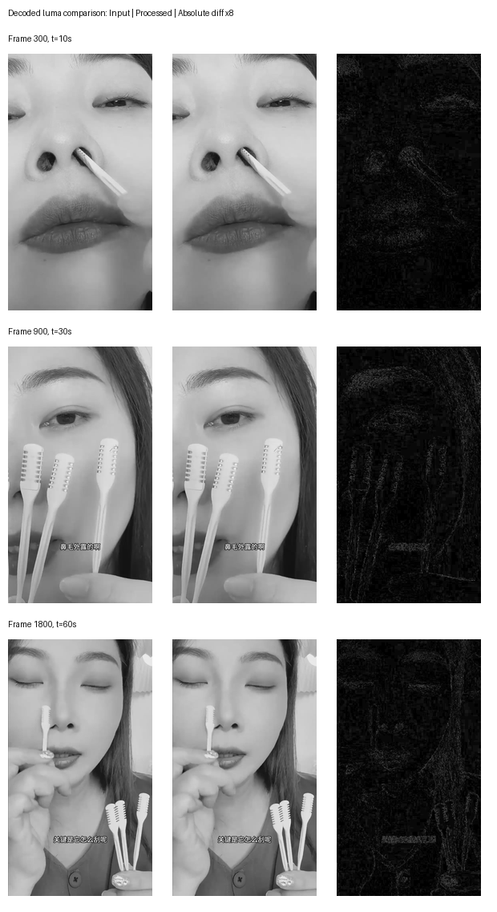

# 原视频与编辑后视频的处理原理分析

日期：2026-10-02。输入：[需求](requirement.md)、`原视频.mp4`、`编辑后视频.mp4`。桌面方案见 [Tauri 设计文档](../../superpowers/specs/2026-10-02-video-processing-desktop-design.md)。

后续提供的 `原视频-1.mp4` / `编辑后视频-1.mp4` 是另一组样本，其重新测量与实验预设见 [样本 1 校准记录](sample-1-calibration.md)。本文的旧样本指标不适用于该组文件。

## 1. 结论

这组样本支持的处理链是：**保持视频时间轴和画面规格，重新生成 H.264 视频码流，进行音频处理并输出 48 kHz AAC，最后重新封装 MP4、改写元数据**。

视频解码后的像素发生了小幅变化，抽样亮度回归还呈现一致的轻微对比度变化；音频变化明显超出本次“仅重采样与 AAC 重编码”对照。最可能包含额外的画面色调调整和音频频谱处理，但两个输出文件不足以唯一恢复滤镜名称、参数、编码器和原始命令。

| 判断 | 证据等级 | 依据 |
| --- | --- | --- |
| 文件内容、元数据和压缩码流发生变化 | 已测事实 | 文件及音视频载荷哈希、MP4 结构、2713 个视频包比较 |
| 视频帧数、时间戳、关键帧位置及主要格式保持一致 | 已测事实 | 包级比较及 MP4 样本表 |
| 解码像素不同，整体画面高度相似 | 已测事实 | 全片 PSNR、SSIM；六帧像素测量及三帧差分图 |
| 视频经过重编码，而非仅重新封装 | 高置信推断 | 全部压缩帧改变，同时解码像素改变；常规转码符合这一现象 |
| 还存在轻微画面色调或对比度处理 | 中等置信推断 | 六帧亮度回归斜率约 1.009～1.011，本次纯转码对照约 0.996～0.999 |
| 音频重采样到 48 kHz 并重新编码为 AAC | 高置信推断 | 采样率、AAC 包数、压缩载荷及解码波形变化 |
| 音频还有额外处理或不同于基线的处理条件 | 高置信推断 | 分频段能量、波形及包络差异，本次普通 AAC 转码对照不能解释 |
| 原软件采用某一条确定的 FFmpeg 命令 | 未确定 | 无进程参数、日志或软件本体；同类结果可由不同处理链产生 |
| 平台没有识别重复内容或搬运 | 未验证 | 用户提供的观察是抖音／小红书正常上传成功，无重复判定对照结果 |

“内容完全一样”在本报告中只能理解为主体内容和观看顺序近似保持。**文件、压缩数据、像素和音频波形均不完全相同**。上传成功没有提供平台内部判定的证据，本次不把“绕过平台检测”作为已证明结论。

## 2. 分析环境与方法

- 环境：macOS 14.8.8，x86_64；FFmpeg `N-124084-g0c6b4ad5fca-tessus`。
- 本机没有 ffprobe；基础信息由 FFmpeg 探测，MP4 时长与样本表通过只读解析取得。软件方案仍随包分发 ffprobe，以 JSON 探测结果为正式接口。
- 视频指标：FFmpeg 原生 H.264 解码，保留输入时间戳，比较全部 2713 帧，不缩放、不额外对齐。PSNR／SSIM 衡量画面差异，不代表任何平台的内容识别结果。[FFmpeg 滤镜文档](https://www.ffmpeg.org/ffmpeg-filters.html#psnr)
- 像素抽样：零起始帧号 `0、30、300、900、1800、2550`，对应 `0、1、10、30、60、85` 秒；亮度在完整 Y 平面计算。
- 音频：两份文件均解码为 48 kHz 双声道浮点 PCM，按 `(L+R)/2` 生成比较用单声道，截取共同长度。局部对齐使用五个两秒窗口，在 ±100 ms 内搜索互相关峰值，并比较去掉两端各 100 ms 的内部区域。
- 分频段能量：4096 点 Hann 窗、2048 点步长，累积单声道功率谱。RMS 是振幅统计，不等同于 LUFS 响度或听觉音量。

测量数据见 [概要](evidence/summary.json)、[详细像素与音频数据](evidence/detailed-measurements.json)、[纯视频重编码对照](evidence/video-baseline-measurements.json)。JSON 是测量记录，不是桌面软件预设。

## 3. 容器、元数据与时间轴

| 项目 | 原视频 | 编辑后视频 |
| --- | --- | --- |
| 文件大小 | 18,964,845 字节 | 18,973,451 字节 |
| 容器 | MP4，`isomiso2avc1mp41` | 相同 |
| 视频 | H.264 Main，720×1280，30 fps | 相同 |
| 像素与颜色标记 | yuv420p，limited range，bt709 | 相同 |
| 像素宽高比 | 1:1 | 相同 |
| 视频帧数 | 2713 | 2713 |
| 视频 time base | 1/15360 | 相同 |
| 视频样本时长 | 1,389,056/15,360 = 90.433333 秒 | 相同 |
| 音频 | AAC LC，44100 Hz，双声道 | AAC LC，48000 Hz，双声道 |
| AAC 包数 | 3896 | 4241 |
| 音频 edit list 播放时长 | 90.441 秒 | 90.453 秒 |
| `mvhd` 容器头时长 | 90.465 秒 | 90.475 秒 |
| `moov` 大小 | 78,124 字节 | 79,665 字节 |
| 视频压缩载荷 | 18,050,048 字节 | 18,049,876 字节 |
| 音频压缩载荷 | 836,625 字节 | 843,862 字节 |
| `title` | 无 | `dedup_67b0cf91_72534` |
| `comment` | `Content Adaptive Encoding 3.1` | `processed_1790831200_1300` |
| `encoder` | `Lavf58.20.100` | 相同 |

两份文件都为 `ftyp → moov → free → mdat`，`moov` 均位于媒体数据之前。因此没有证据表明“把 moov 移到文件开头”是两者的关键差别，也未发现额外顶层轨道或大体积填充块。

总大小增加 8606 字节，可以拆为：视频载荷减少 172 字节、音频载荷增加 7237 字节、`moov` 增加 1541 字节。**视频载荷大小近似相等，并不意味着视频流被原样复制。**

视频包的 DTS、PTS、duration 全部一致；关键帧从 1 开始的帧编号均为 `1、301、601、901、1201、1501、1801、2101、2401、2701`。抽出的 SPS／PPS 也一致。没有在这些数据中观察到帧率变化、关键帧位置变化或视频时间轴加速；这不排除保持时间轴的像素滤镜。

容器头、轨道和解码 PCM 使用不同的时长口径；AAC 编码延迟、尾部填充与 edit list 也会影响结果。不能把上述约 10～12 ms 的尾部差异直接解释成变速或人工插帧。

`encoder` 标签是可复制、可指定的元数据，它不能确定原软件实际运行的 FFmpeg 版本。`dedup` 和 `processed` 文本可以表明软件的命名方式，不能证明检测效果。

## 4. 文件和码流身份

原文件 SHA-256：

```text
c4fd9bc7b1c8fc928848808aee0ffd7b0c961fffb449f92587f3c756211d8beb
```

编辑后文件 SHA-256：

```text
3cb1dc9c019a787fd747f69590971830331d6e3913d9b7222a3bd55bcf16f575
```

以 stream copy 方式，对解复用后的压缩载荷计算 SHA-256：[FFmpeg hash／framehash 文档](https://ffmpeg.org/ffmpeg-formats.html#hash)

| 载荷 | 原视频 | 编辑后视频 |
| --- | --- | --- |
| H.264 | `edd147502b460667f4e241d1040c84718da9ea2f16583ef510e0b35d34aee1d1` | `723a00f06a08e7f409f8765b988e4e58e68fd74159b9a7b84c6c6e3120aca633` |
| AAC | `34d4ea563c1d1da74b2f5db551402c176325a987bc74d6b001ee3c69cb21c522` | `58aa43e25631d8228877b4c7114d24289e1dd0778df96a7adcc47cacf0ad43e2` |

2713 个视频包的内容哈希全部不同，其中 2711 个包的大小也不同。Annex B 对比中，2713 个图像 slice 均改变，SPS／PPS 未改变；两份样本都未在该抽取结果中出现 SEI NAL。因此，单纯改标签、改文件名，或仅插入 SEI，均不足以解释这组样本。

这里比较的是 FFmpeg 解复用输出的压缩载荷，而非整个 MP4；附录中的 `-c copy` 必须保留，否则默认编码的 hash 输出会变成另一种比较对象。

## 5. 画面差异及纯重编码对照

### 5.1 全片指标

| 比较对象 | PSNR 平均值 | SSIM All |
| --- | --- | --- |
| 原视频 vs 编辑后视频 | 41.055910 dB | 0.982761 |
| 原视频 vs 无滤镜 libx264 对照 | 44.570562 dB | 0.990210 |
| 无滤镜 libx264 对照 vs 编辑后视频 | 40.424325 dB | 0.980514 |

编辑后视频与原视频的分量 PSNR 为 Y=39.741940、U=48.292972、V=45.058860 dB；SSIM 为 Y=0.978428、U=0.992672、V=0.990181。单帧平均 PSNR 范围为 34.892038～58.505092 dB，差异随内容变化。

无滤镜对照使用 `libx264 / veryfast / Main / level 3.1 / 1596000 bit/s / GOP 300 / B 帧 0`。它是**一个已运行的基线**，不是原软件编码器的复原；其他编码器、码率控制或预设可以产生不同损失，不能仅凭指标差距排除所有“纯重编码”方案。

### 5.2 抽样亮度与几何检查

对每帧亮度拟合 `Y_processed = a × Y_original + b + residual`，Y 为 8 bit 编码值：

| 时间 | 编辑后亮度斜率 a | 偏移 b | Y 平面 RMSE | 纯重编码对照斜率 a |
| --- | --- | --- | --- | --- |
| 0 秒 | 1.00910 | -0.839 | 2.188 | 0.99866 |
| 1 秒 | 1.00996 | -1.044 | 1.769 | 0.99827 |
| 10 秒 | 1.01098 | -1.217 | 1.864 | 0.99917 |
| 30 秒 | 1.01065 | -1.167 | 2.247 | 0.99934 |
| 60 秒 | 1.00875 | -0.752 | 2.305 | 0.99783 |
| 85 秒 | 1.00910 | -0.948 | 2.813 | 0.99618 |

抽样 U 平均变化约 +0.137～+0.346，V 约 +0.647～+1.034。六帧 Y 平面的像素完全相同占比约 23%～28%。结合一致的亮度斜率偏移，轻微对比度或色调调整是合理候选；这些回归值**不能直接当作 FFmpeg `eq` 的确定参数**。

六帧在 ±3 像素整数平移搜索中，最优偏移均为 `(0,0)`；水平镜像对比 RMSE 明显更大。这支持抽样帧保持原有构图。检查范围有限，不能据此证明全片没有亚像素缩放、局部处理或极轻微裁切。

下图是解码后的 **Y 亮度分量**：左为原视频，中为编辑后视频，右为绝对差异放大 8 倍。为排版进行了缩小，指标计算使用原始尺寸；它不是原视频的完整彩色预览。



## 6. 音频差异及对照

共同长度下，原视频单声道 RMS 为 0.12817849，编辑后为 0.08835657，即变化约 **-3.2315 dB**。零延迟波形相关系数为 -0.01504，25 ms RMS 包络相关系数为 0.79266。

零延迟相关性受时移和相位影响，因此进一步进行局部对齐：

| 两秒窗口起点 | 局部最优时移 | 对齐后的相关系数 |
| --- | --- | --- |
| 2 秒 | 4.979 ms | 0.6031 |
| 10 秒 | 4.979 ms | 0.5868 |
| 30 秒 | 4.854 ms | 0.4690 |
| 60 秒 | 5.000 ms | 0.7121 |
| 85 秒 | 7.042 ms | 0.2774 |

这是局部相关峰位置，不是测得的固定编码延迟或整段音画同步偏差。经过局部对齐，波形仍不接近完全一致。

| 频段 | 编辑后相对原视频的功率变化 | 普通 AAC 基线相对原视频 |
| --- | --- | --- |
| 0～150 Hz | -11.701 dB | -0.046 dB |
| 150～500 Hz | -2.600 dB | -0.016 dB |
| 500～2000 Hz | -3.842 dB | -0.030 dB |
| 2000～5000 Hz | +0.171 dB | -0.024 dB |
| 5000～10000 Hz | -3.146 dB | -0.115 dB |
| 10000～20000 Hz | -4.694 dB | +0.051 dB |

基线只做 `AAC / 48000 Hz / 74 kbit/s` 转码，与原视频零延迟波形相关系数约 0.99874，RMS 仅变化 -0.0240 dB，25 ms 包络相关系数约 0.99988。

这一对照支持：**本次普通重采样与 AAC 转码不能解释编辑后音频，单一固定音量调整也不能解释频段间的不均匀变化**。低频抑制、均衡、相位处理、动态处理等均可作为候选。尚未定位具体滤镜，未证明变调、加噪或变速；不把这些操作写成确定事实。

两份音频的左右声道相关系数均接近 1，均表现为高度相似的双声道内容。解码后长度相差约 11.6 ms，尾部差异不足以单独证明变速。

## 7. 最可能的实现方式与落地含义

```text
输入 MP4
  ├─ 视频：解码 → 候选轻微色调处理 → H.264 Main 编码
  │         保持 720×1280、30 fps、帧数、时间轴与关键帧位置
  ├─ 音频：解码 → 未定位的频谱／其他音频处理 → 48 kHz AAC 编码
  └─ 容器：写入 title／comment → 重建 MP4 索引与样本表
输出 MP4
```

可用 FFmpeg 实现这些处理类别。当前已证实的是结果中的结构与差异，以上滤镜步骤仍有推断成分；现有材料不支持承诺与原软件逐字节一致，也无法证明这些变化对平台重复检测的作用。

建议桌面软件先使用可复现的基础转码预设建立任务、校验和分发闭环，再单独校准样本研究预设。色调和音频滤镜应记录参数、版本及对照结果；没有验证的组合不标为“已复现原软件”。具体模块与验收见 [桌面方案](../../superpowers/specs/2026-10-02-video-processing-desktop-design.md)。

若需要继续定位处理细节，最有价值的新证据是同一输入的多次输出、软件可选设置、可取得的 FFmpeg 命令或日志，以及已知纯色／灰阶／音调测试片的处理结果。它们可以分别缩小随机处理、色彩映射和音频滤波的歧义。本次报告不依赖这些额外材料。

## 8. 复现命令

以下命令从仓库根目录执行。确保 FFmpeg 在 PATH 中，Windows 可使用 `ffmpeg.exe`；基线输出前先创建独立的 `scratch` 目录。命令不覆盖输入，`-n` 在输出已存在时拒绝写入。

### 基础探测

```sh
ffmpeg -hide_banner -i "docs/requirements/20261002-research/原视频.mp4" -t 0 -f null -
ffmpeg -hide_banner -i "docs/requirements/20261002-research/编辑后视频.mp4" -t 0 -f null -
```

### 压缩载荷与视频包

```sh
ffmpeg -v error -i "docs/requirements/20261002-research/原视频.mp4" -map 0:v:0 -c copy -f hash -
ffmpeg -v error -i "docs/requirements/20261002-research/编辑后视频.mp4" -map 0:v:0 -c copy -f hash -
ffmpeg -v error -i "docs/requirements/20261002-research/原视频.mp4" -map 0:a:0 -c copy -f hash -
ffmpeg -v error -i "docs/requirements/20261002-research/编辑后视频.mp4" -map 0:a:0 -c copy -f hash -
ffmpeg -v error -i "docs/requirements/20261002-research/原视频.mp4" -map 0:v:0 -c copy -f framemd5 -
ffmpeg -v error -i "docs/requirements/20261002-research/编辑后视频.mp4" -map 0:v:0 -c copy -f framemd5 -
```

### 全片画面指标

```sh
ffmpeg -hide_banner -nostats -i "docs/requirements/20261002-research/原视频.mp4" -i "docs/requirements/20261002-research/编辑后视频.mp4" -lavfi "[0:v:0][1:v:0]psnr" -an -f null -
ffmpeg -hide_banner -nostats -i "docs/requirements/20261002-research/原视频.mp4" -i "docs/requirements/20261002-research/编辑后视频.mp4" -lavfi "[0:v:0][1:v:0]ssim" -an -f null -
```

### 已运行的对照处理

```sh
ffmpeg -hide_banner -nostats -n -i "docs/requirements/20261002-research/原视频.mp4" -map 0:v:0 -an -c:v libx264 -preset veryfast -profile:v main -level:v 3.1 -b:v 1596000 -g 300 -keyint_min 300 -sc_threshold 0 -bf 0 -pix_fmt yuv420p -video_track_timescale 15360 "scratch/video-baseline.mp4"
ffmpeg -hide_banner -nostats -n -i "docs/requirements/20261002-research/原视频.mp4" -map 0:a:0 -c:a aac -ar 48000 -b:a 74k "scratch/audio-baseline.m4a"
```

把上述画面指标命令的第二输入替换为 `scratch/video-baseline.mp4`，可复核原视频与视频基线的比较。音频数据可按第 2 节定义的算法复算，PCM 导出示例：

```sh
ffmpeg -v error -n -i "docs/requirements/20261002-research/原视频.mp4" -map 0:a:0 -ac 2 -ar 48000 -f f32le "scratch/original-stereo-48k.f32"
ffmpeg -v error -n -i "docs/requirements/20261002-research/编辑后视频.mp4" -map 0:a:0 -ac 2 -ar 48000 -f f32le "scratch/processed-stereo-48k.f32"
```

原生解码指标和压缩载荷哈希应可复核；不同 FFmpeg／libx264 构建生成的基线文件和基线指标不要求逐字节或逐小数一致。证据中记录了本次版本和方法，暂存的基线媒体不属于交付文件。
