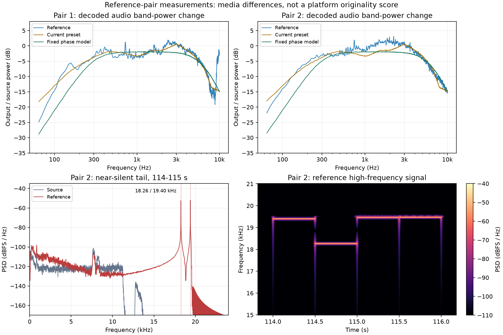

# 两组原视频与参考输出的差异分析

日期：2026-10-09。测量对象为 `原视频-1.mp4` / `编辑后视频-1.mp4` 与 `原视频-2.mp4` / `编辑后视频-2.mp4`。两组输入均只读，处理前后 SHA256 一致。原始测量见 [证据 JSON](evidence/reference-pairs-measurements.json)，第一轮实验背景见 [样本 1 校准记录](sample-1-calibration.md)。

用户确认第一组参考输出现在仍能通过平台审核，并报告第二组参考输出同样可以通过。上次本软件的 `sample-match-v1` 测试输出未通过，被限制为仅主页可见。以上审核结果均来自用户反馈，本次没有访问平台后台，也没有独立取得实际上传文件的哈希。

本次发现了上次未复现的音频延迟、相位及第二组的额外高频窄带信号；两组视频编码配置也明显不同。这些是媒体差异的证据，尚未建立任何差异与审核通过之间的因果关系。

## 文件身份与基本规格

| 文件 | SHA256 |
| --- | --- |
| 原视频-1.mp4 | `a3c0e92cdb373cb42190a67dd304a1e48077a09d1720ad0d1d1b4c3318742307` |
| 编辑后视频-1.mp4 | `5077d1901cd5c8a7166f80bea2cd272e6d7e44174b4f9e2e0b3f48b71ce5e17b` |
| 原视频-2.mp4 | `01d82ded9b53f1cf3908507c0ede2e83aa375396089398706d304ae73c65e7e8` |
| 编辑后视频-2.mp4 | `610ab9b3ad3c519bdafc194ed45a6b00522f387d63cec784f8821cba767157fe` |

| 项目 | 第一组原片 → 参考 | 第二组原片 → 参考 |
| --- | --- | --- |
| 尺寸 | 720×720 → 相同 | 1080×1440 → 相同 |
| 帧率 | 25 fps → 相同 | 30 fps → 相同 |
| 解码帧数 | 2990 → 相同 | 3507 → 相同 |
| 视频时长 | 119.6 秒 → 相同 | 116.9 秒 → 相同 |
| 时间基 | 1/12800 → 相同 | 1/15360 → 相同 |
| 逐帧 PTS 与帧时长 | 相同 | 相同 |
| H.264 profile | High → Main | High → Constrained Baseline |
| B 帧 | 有 → 无 | 有 → 无 |
| 参考关键帧间隔 | 300 帧，12 秒 | 250 帧，约 8.33 秒 |
| 视频平均码率 | 930,665 → 1,163,943 bit/s，约 1.25 倍 | 1,850,398 → 7,118,084 bit/s，约 3.85 倍 |
| AAC 采样率 | 44.1 → 48 kHz | 44.1 → 48 kHz |
| 音频声道 | 双声道 → 双声道 | 双声道 → 双声道 |
| 音频平均码率 | 64,798 → 72,354 bit/s | 128,560 → 192,692 bit/s |
| 音频时长 | 119.606009 → 119.616 秒 | 116.911995 → 116.928 秒 |
| 容器 encoder 标签 | 参考为 Lavf58.20.100 | 参考为 Lavf62.12.100 |

没有证据支持这两组采用相同的固定 GOP、固定码率倍率或固定音频码率。音频时长的微小变化也不等于整段视频变速；解码样本数还受 AAC 帧长度、延迟补偿与尾部填充影响。

## 第二组保留的编码器参数

从第二组参考视频首包的 H.264 SEI 中读取到 x264 core 165 r3223 0480cb0，以及以下参数：

```text
cabac=0 ref=1 deblock=0:0:0 analyse=0:0 me=dia subme=0
trellis=0 8x8dct=0 bframes=0 weightp=0
keyint=250 keyint_min=25 scenecut=0
rc=crf crf=23.0 mbtree=0 aq=0 threads=18
```

这些配置与 x264 的 `ultrafast` 预设特征一致，可由 [x264 预设源码](https://raw.githubusercontent.com/mirror/x264/master/common/base.c) 核对。这是依据码流参数作出的推断，不能排除逐项设置参数的等价命令。第一组参考首包没有同等可读的编码器 SEI，无法这样恢复其参数。

第二组的 3.85 倍平均码率是本次编码的实际结果，不能解释为固定码率放大策略；码流明确记录了 CRF 23。两组的 encoder 标签与编码结构差异也不能单独确定软件版本或用户所选模式。

两份参考均新增 `dedup_*` 格式的 title 与 `processed_*` 格式的 comment，具体值不同。现有实验预设保留源标题和备注，并写入真实预设 ID，没有复制这组标签。标签与 SEI 都属于已观察到的结构差异，但目前没有它们影响审核的证据；尤其第二组保留了编码器 SEI，不能把移除 SEI 当作两组共同策略。

## 画面：时间轴一致，微小变化不通用

在两组的 0、约 0.04、约 0.08、1、10、30、60、100、115 秒处按帧号抽样，直接比较 YUV 平面。第二组前两帧分别位于 0.0333、0.0667 秒。±2 像素整数平移搜索的最优位置均为 `(0, 0)`。该结果只排除了这些抽样位置、该搜索范围内的整体平移，不能排除亚像素、局部或未抽样时刻的变化。

| 抽样指标 | 第一组 | 第二组 |
| --- | --- | --- |
| Y 平面线性回归斜率 | 0.9750–0.9869 | 1.0005–1.0037 |
| Y 平面回归截距 | −0.312–0.451 | −1.064–−0.772 |
| 扣除线性映射后的 Y 残差 RMSE | 1.53–5.02 级 | 1.00–3.07 级 |

第一组更接近略微降低亮度幅度；第二组更接近小幅负偏移。现有 `lutyuv` 斜率 0.985 针对第一组，不能直接当作第二组的通用参数。色度回归也随帧变化，不能从这些数值唯一确定固定饱和度或色相滤镜；编码量化、去块设置和纹理分布会影响回归结果。

第二组按首包参数构建了无画面滤镜的编码对照：`libx264 / ultrafast / CRF 23 / GOP 250 / threads 18`，保留原 PTS，关闭场景切换关键帧。结果如下，均与参考输出进行全片比较：

| 比较对象 | PSNR | SSIM |
| --- | --- | --- |
| 原片 | 43.902799 dB | 0.986883 |
| 无画面滤镜的编码对照 | 43.303126 dB | 0.984637 |
| 编码对照解码后额外减 1 级 Y | 43.461705 dB | 0.984670 |

匹配编码结构没有恢复参考画面；简单减 1 级也只能改善一小部分误差。第三项是在已解码对照上变换 Y，没有再次编码；不能将它当作完整处理命令的效果。当前 FFmpeg/x264 构建与参考的编码器版本也不同，无法从剩余残差中直接分离编码器差异与滤镜差异。

## 音频：相位和约 5 毫秒延迟是两组共有的差异

两组都统一解码到 48 kHz 双声道浮点 PCM，按相同时间起点比较，分析时左右声道取均值。新比较统一使用 8192 点 Hann 窗、4096 点步长；第一轮的 4096 点统计在频段边界处略有不同，不直接混用。

| 输出相对原音频的变化 | 第一组 | 第二组 |
| --- | --- | --- |
| 全片 RMS | −3.676 dB | −4.310 dB |
| 零时移波形相关系数 | −0.0068 | −0.0134 |
| 0–150 Hz 功率 | −14.677 dB | −12.532 dB |
| 150–500 Hz 功率 | −3.800 dB | −4.192 dB |
| 500–2000 Hz 功率 | −3.115 dB | −0.791 dB |
| 2000–5000 Hz 功率 | −0.127 dB | −0.538 dB |
| 5000–10000 Hz 功率 | −7.388 dB | −7.194 dB |
| 10000–20000 Hz 功率 | −2.417 dB | +8.559 dB |

第一组原片 10–20 kHz 的能量仅占约 0.000058%，该频段的幅度比不稳定，不应过度解释。第二组这一频段的原片能量占约 0.104%，并且参考输出有新增的窄带成分，见下一节。

第一轮局部对齐只寻找最大的正相关峰。重新在 ±100 毫秒内寻找绝对相关峰后，第一组在约 5.54–5.69 毫秒出现 −0.71 至 −0.84 的更强负相关；第二组的非静音窗口也出现相似现象。负相关峰不等于使用了显式反相滤镜：高通、低通和延迟组合本身会改变频率与相位关系。

对复数互谱传递函数拟合二阶高通、二阶低通、延迟和实数增益后，得到下列近似模型：

| 模型估计 | 第一组 | 第二组 |
| --- | --- | --- |
| 高通截止频率 | 313.1 Hz | 313.3 Hz |
| 低通截止频率 | 5742 Hz | 5250 Hz |
| 延迟 | 4.998 ms | 4.992 ms |
| 实数增益 | 0.724 | 0.828 |
| 复数传递函数归一化误差 | 0.0612 | 0.0564 |

这些参数是受频率权重、模型选择与局部搜索影响的近似估计，并非原软件的已恢复命令。滤波器的幅度与相位是不同维度，参见 [FFmpeg 音频滤镜文档](https://ffmpeg.org/ffmpeg-filters.html#allpass)。现有预设只近似幅度包络，且补偿了 FIR 延迟，因此没有复现这一相位特征。

进一步固定同一组参数，对两份原片执行纯音频诊断对照：

```text
highpass=f=300,lowpass=f=5500,adelay=5:all=1,volume=0.8
```

| 解码 PCM 与参考的零时移相关系数 | 第一组 | 第二组 |
| --- | --- | --- |
| 现有实验预设的音频滤镜 | 0.3996 | 0.1609 |
| 同一组固定的高通 / 低通 / 延迟模型 | 0.8575 | 0.8392 |

这组参数没有针对第二组另行调节。对照使用纯 PCM，没有 AAC 重编码，也没有运行应用任务服务；不能将其视为新预设或已通过审核的视频。按最优标量增益修正后，仍有约 26.5% / 29.6% 的归一化音频残差。

对非近静音的 0.25 秒窗口拟合增益时，增益与模型信号 RMS 的相关系数为 −0.823 / −0.867，符合与音量相关的处理特征。这提示还需调查动态增益或非线性处理，但频谱变化等因素也会影响该统计，不能据此唯一确定压缩器、归一化器或具体参数。

## 第二组：原片近静音处出现额外高频窄带信号

在 114–115 秒窗口：

| 指标 | 原片 | 参考输出 |
| --- | --- | --- |
| RMS | −72.112 dBFS | −36.495 dBFS |
| 主要新增窄带峰 | 未观察到同等强度成分 | 约 19.40 / 18.26 kHz |
| 参考 0.1 秒窗口 RMS 范围 | — | −36.513 至 −36.478 dBFS |
| 左右声道相关性 | 接近 1 | 接近 1 |

0.1 秒窗口显示，114.0–114.4 秒的主要峰约为 19.399 kHz，114.5–114.9 秒约为 18.263 kHz。额外能量稳定，频率发生切换；其分布与窄带振荡信号相符，比“普通宽带噪声”更能解释观测结果。不能据此确定产生方式、随机策略、完整切换周期或目的，也不能断言其造成平台审核通过。

第一组未观察到同等强度的高频成分，但其参考 AAC 码率明显更低；编码带宽可能影响此类信号的保留。当前无法区分第一组没有生成、生成后被编码削弱，或采用其他参数这几种解释。



图中比较媒体频谱，纵轴不是原创度。上方对照与波形相关对照相同，均为未重编码的 PCM；下方为第二组真实参考输出的尾段。可缩放版本见 [SVG](evidence/reference-pairs-audio.svg)。

## 本次结论与后续验证边界

已确认的共同特征是尺寸和逐帧时间轴保留、参考无 B 帧、AAC 48 kHz，以及音频低频 / 高频衰减与约 5 毫秒的延迟模型。尚不能把 GOP、码率倍率、画面亮度映射和音频码率当作固定通用策略。

上次只匹配亮度回归和音频频段幅度，遗漏了相位、延迟、可能的动态增益，以及第二组可见的额外高频窄带成分。本地测试没有覆盖参考的完整波形处理，也不能测量平台审核结果，因此测试通过未能验证用户的最终目标。

如继续实现，应分别验证画面编码配置与音频相位 / 动态处理，用冻结参数的对照输出检查两组完整波形和时间轴，再记录实际审核结果。高频成分的产生方式目前未确定，不能凭一个静音片段直接制定通用注入策略。每个差异是否影响审核，需要单独的对照证据；两份参考输出成功不能证明其中任何一个滤镜是决定因素。

本次只新增分析材料并更新审核反馈记录，没有修改生产预设、构建或发布新应用。

后续实现记录见 [样本处理 v2 验证](phase-v2-validation.md)：新增相位实验预设，并检查两组真实应用 MP4。该记录还说明 v1 纯 PCM 与实际 MP4 的约 6.979 毫秒波形对齐差异，实际输出指标应以该记录为准。用户随后反馈两份 v2 均未通过审核；继续验证编码、动态增益和高频信号的独立对照见 [第三轮实验](round3-experiments.md)。
